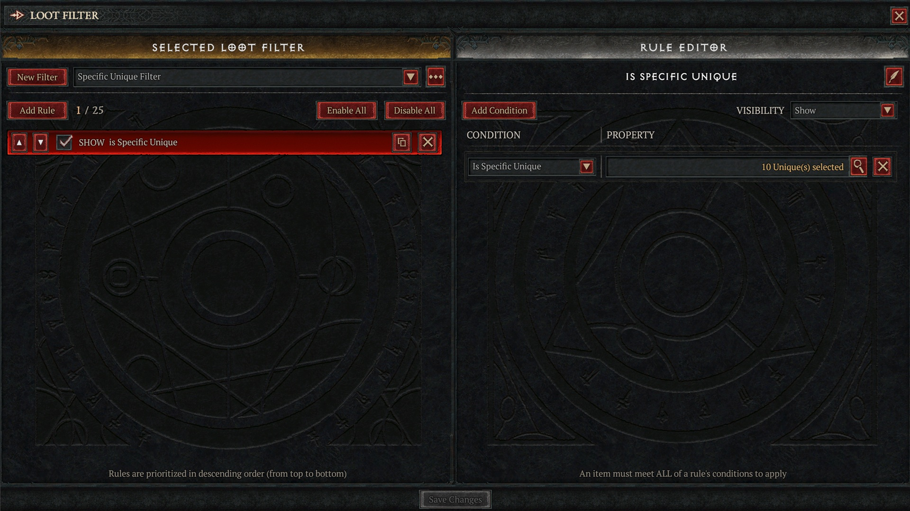

# Obtain Base64 Encoded Filter

1. From within Diablo 4, navigate to the Loot Filter menu.
2. Create a filter.
3. From the ellipsis menu (3 horizontal dots located to the right of the filter name), select **Export Filter**.

The filter contents are now stored in your clipboard.

# Examine Filter

1. Paste the filter into hexeditor.

~~~text
ClMKEmlzIFNwZWNpZmljIFVuaXF1ZRAAHQAA//8iNAgIFTdoAwAViOcTABWrqx0AFdW6JwAVuHsFABUlbh8AFZO9JgAVWV8DABXSqx0AFbQQJAAoARIWU3BlY2lmaWMgVW5pcXVlIEZpbHRlchgFIAI=
~~~

Note: Your filter string will be different unless you created an identical filter.

Inspection shows that the filter contents are Base64-encoded, presumably to simplify sharing on the web. An interesting detail is that the game does not appear to use URL-safe Base64 encoding.

# Extract and Save Raw Filter

Windows:
~~~PowerShell
[System.IO.File]::WriteAllBytes((Join-Path (Get-Location) "filter_test_case.bin"), [System.Convert]::FromBase64String($(Get-Clipboard)))
~~~

macOS:
~~~sh
pbpaste | base64 --decode > filter_test_case.bin
~~~

Linux:
~~~sh
xclip -selection clipboard -o | base64 --decode > filter_test_case.bin
~~~

# Raw Filter Output

~~~sh
xxd -g1 filter_test_case.bin
~~~
~~~hexdump
00000000: 0a 53 0a 12 69 73 20 53 70 65 63 69 66 69 63 20  .S..is Specific
00000010: 55 6e 69 71 75 65 10 00 1d 00 00 ff ff 22 34 08  Unique......."4.
00000020: 08 15 37 68 03 00 15 88 e7 13 00 15 ab ab 1d 00  ..7h............
00000030: 15 d5 ba 27 00 15 b8 7b 05 00 15 25 6e 1f 00 15  ...'...{...%n...
00000040: 93 bd 26 00 15 59 5f 03 00 15 d2 ab 1d 00 15 b4  ..&..Y_.........
00000050: 10 24 00 28 01 12 16 53 70 65 63 69 66 69 63 20  .$.(...Specific
00000060: 55 6e 69 71 75 65 20 46 69 6c 74 65 72 18 05 20  Unique Filter..
00000070: 02                                               .
~~~

# Identify the Data

Now that we can look at the thing, we need to figure out wtf we are dealing with.  I have to admit, I got a bit lucky
here because I have some familiarity with Protocol Buffers (protobufs) due to the type of work I do, albeit rather 
orthogonally.

Unlike many binary serialization and container formats, protobuf payloads lack a canonical file signature 
(“[magic bytes](https://en.wikipedia.org/wiki/List_of_file_signatures)”) suitable for deterministic identification. 
Consequently, protobuf messages cannot be reliably classified via conventional signature-based tooling such as the 
`file` command. Although `file` also incorporates heuristic analysis, the sampled data may not have contained sufficient
statistical signal for reliable classification.
 

~~~sh
file specific_unique_filter.bin 
~~~
~~~
specific_unique_filter.bin: data
~~~

# Don't be Stupid (Parsing the Wire Format)

One interesting thing I learned while on this task was that protobuf serialization, although deterministic, isn't canonical.  This is due to the
unknown field problem.

In the wire format, bytes fields and nested sub-messages use the same wire type. This ambiguity makes it impossible to
correctly canonicalize messages stored in the unknown field set. Since the exact same contents may be either one, it is
impossible to know whether to treat it as a message and recurse down or not.

Reading this, something clicked for me, because I had noticed that the order of items in lists weren't stable when minor
changes to the filter were made and compared to previous versions.  It reminded me of how back in the day dictionaries
didn't preserve insertion order.

There are two concepts that underpin the protobuf format: base 128 varints and the overall message structure, both of 
which are covered in detail at the [Protocol Buffers Documentation](https://protobuf.dev/programming-guides/encoding/)
page. Using the project's documentation I wrote a simple parser to aid in my understanding.  It should be noted that the
`protoscope` program was designed to inspect, create, and read raw protobuf messages, but I wanted to be sure I had
a complete understanding.

~~~sh
lootfilter.py ClMKEmlzIFNwZWNpZmljIFVuaXF1ZRAAHQAA//8iNAgIFTdoAwAViOcTABWrqx0AFdW6JwAVuHsFABUlbh8AFZO9JgAVWV8DABXSqx0AFbQQJAAoARIWU3BlY2lmaWMgVW5pcXVlIEZpbHRlchgFIAI=
~~~
~~~terminal
1: {
  1: "is Specific Unique"
  2: 0
  3: 0xffff0000
  4: {
    1: 8
    2: 0x00036837
    2: 0x0013e788
    2: 0x001dabab
    2: 0x0027bad5
    2: 0x00057bb8
    2: 0x001f6e25
    2: 0x0026bd93
    2: 0x00035f59
    2: 0x001dabd2
    2: 0x002410b4
  }
  5: 1
}
2: "Specific Unique Filter"
3: 5
4: 2
~~~

~~~bash
protoscope specific_unique.bin
~~~
~~~bash
1: {
  1: {
    13: 2.1575476726191122e185  # 0x6669636570532073i64
    13: 5.56113278642854e180    # 0x657571696e552063i64
  }
  2: 0
  3: 0xffff0000i32
  4: {
    1: 8
    2: 223287i32
    2: 1304456i32
    2: 1944491i32
    2: 2603733i32
    2: 359352i32
    2: 2059813i32
    2: 2538899i32
    2: 221017i32
    2: 1944530i32
    2: 2363572i32
  }
  5: 1
}
2: {"Specific Unique Filter"}
3: 5
4: 2
~~~

Interestingly, my heuristic for finding and printing strings, which is pretty simple, was able to decode both the
filter's name and the name of the rule that been applied whereas `protoscope` struggled to identify the rule name.  If
you were paying attention you would have noticed that the values 

# References

- [magic bytes](https://en.wikipedia.org/wiki/List_of_file_signatures)
- [Protocol Buffer Encoding](https://protobuf.dev/programming-guides/encoding/)
- [Demystifying the Protobuf Wire Format](https://kreya.app/blog/protocolbuffers-wire-format/)
- [Why is varint an efficient data representation](https://stackoverflow.com/questions/24614553/why-is-varint-an-efficient-data-representation)